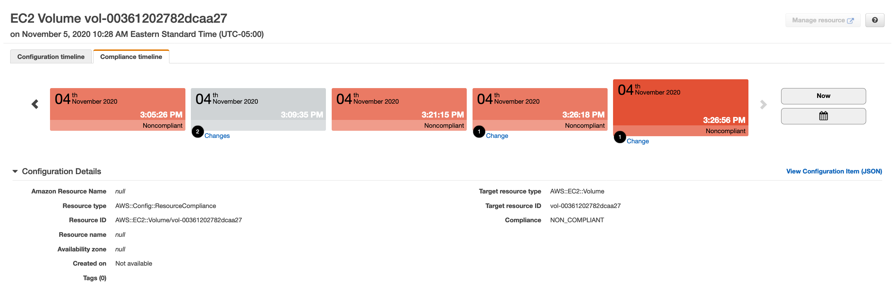

# AWS Config Service
AWS Config allows you to assess configuration based on predefined rules and custom rules based on lambda functions. When looking over a recent SOC audit, the config would help analyze rule sets such as encrypted RDS, public access denial, encrypted volumes, etc. These results can then be aggregated to a parent account through a two-way authorization handshake, providing one view for all benchmarks.

## Implementation

In testing, I took a sandbox account and then applied several rules.

##### Components Needed:

- config configuration recorder
    - the mechanism for snapshotting AWS resources
- config delivery channel
    - the means to deliver data from the recorder to the topic/bucket
- S3 bucket
    - the place where data is stored
- SNS topic
- config rule
    - rules to analyze

Utilizing aggregation, it becomes seamless to view all the non-compliant resources to act on:

You can then drill into the respective resource to view the non-compliant resources, then determine when the resource compliance changed.

## Downsides
AWS Config provides a lot of ease of use and could remove some of the compliance hurdles, which can also be troublesome in some cases. Some of the limitations I discovered in researching:
- Management overhead
    - Code deployments of config rules, bucket, topic, etc. to every account. You must deploy all resources to all accounts; the aggregation feature does not permit the ruleset to be defined in one location.
- Manual Config
    -  AWS provides a large number of rules, but all require manual enablement. If utilizing a vendor, they write the rules for you; moreover, you would become a rule manager.

### Example Code
This code only has defined a single delivery channel in the provider region, us-east-1. If implemented, multiple delivery channels should for multi-region support.

### Reference:
https://docs.aws.amazon.com/config/latest/developerguide/managed-rules-by-aws-config.html - managed rule set
https://docs.aws.amazon.com/config/latest/developerguide/aggregate-data.html - configuring aggregation
